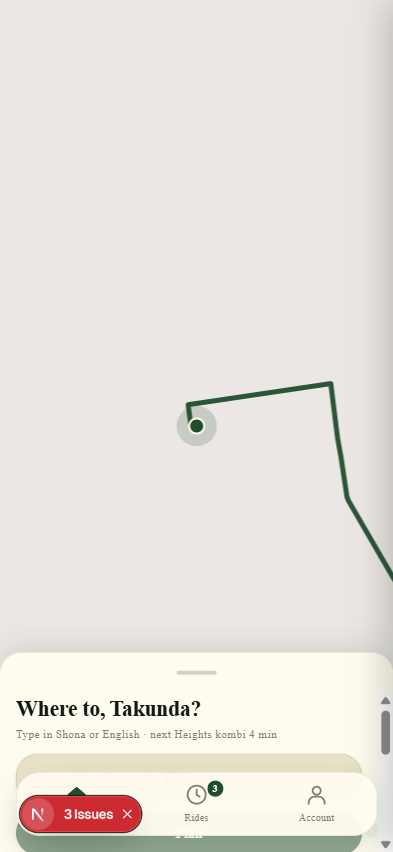
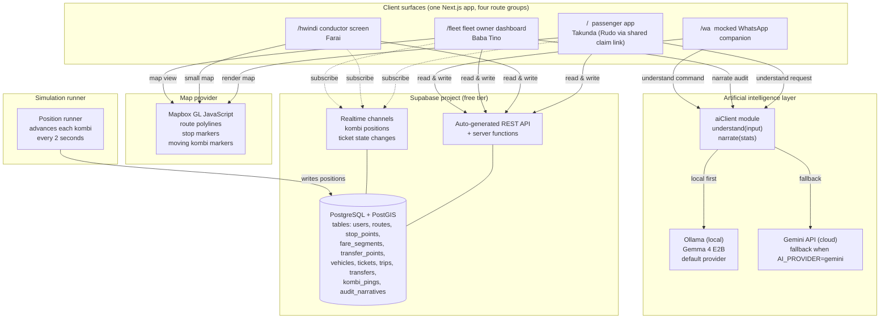

<div align="center">


**Digital tickets, real revenue, same kombi.**

A digital ticketing and trip planning system for Harare's informal kombi network.

[](https://svika.vercel.app)
[](https://gdg.community.dev/gdg-harare/)
[](https://nextjs.org)
[](https://supabase.com)
[](./LICENSE)

</div>

<div align="center">



<sub><i>Live kombi map filtered to the rider's suburb, with route polylines and bearing rotated kombi markers.</i></sub>

</div>

## The pitch

In Zimbabwe, riding a kombi means three problems that have not changed in decades. You ask a stranger at the rank which kombi to take, because the network lives in people's heads, not on any map. You wait blind for it to arrive, because there are no schedules, no apps, no live signal. You fight over change when it does, because the economy runs on cash and conductors never carry small notes.

Svika fixes all three. It is a digital ticketing and trip planning system for Harare's informal kombi network. Riders plan trips in Shona or English, pay digitally or reserve cash on board, board with a 3 digit code, and transfer spare tickets over WhatsApp. Conductors clear fares with one tap. Fleet owners see a daily bilingual revenue audit produced by Gemma running on device.

Same kombi, same hwindi, more trust.

## Quick links

- Live: https://svika.vercel.app
- Submission: GDG Harare Build with AI 2026
- Documentation: see [`docs/`](docs/)
- Architecture diagram: [`docs/diagrams/system-architecture.mmd`](docs/diagrams/system-architecture.mmd)

## A short glossary for visiting judges

A few words appear throughout this repo and the demo video. They are everyday speech in Zimbabwe, not jargon.

- **Kombi.** A 15 seat Toyota Hiace minibus running a fixed informal route. The country's main mode of transport.
- **Hwindi.** The conductor on a kombi. Calls passengers, collects fares, manages boarding, opens and closes the side door.
- **Mhanya.** Shona for *rush*. Used in route names where applicable.
- **Rank.** A kombi rank. The point where a route starts and ends, where kombis queue and fill.
- **Svika.** Shona verb meaning *to arrive*. Pronounced *svee ka*.
- **ZIMRA.** Zimbabwe Revenue Authority. The country's tax collector.
- **ZUPCO.** The state owned bus company that runs alongside the kombi network.

## Why I built it

I grew up riding kombis. Everyone in Harare did. The network is enormous and almost entirely undocumented. There is no map. There is no schedule. There is no receipt. Conductors hold the routing knowledge, drivers hold the timing, and passengers hold cash and hope. Every single trip is a small negotiation, repeated millions of times a day, conducted entirely on memory and trust.

The interesting question is not how to replace this system. Replacement projects already exist; ZUPCO buses run alongside the kombis, and ride hailing apps cover the high end. The interesting question is how to add a thin digital layer that preserves what works (the routes, the conductors, the kombis themselves) and fixes what does not (the change fights, the fare opacity, the invisibility to fleet owners and to the tax authority). That is what Svika tries to be. A small set of surfaces that make the existing network more honest, more legible, and easier to use for someone who did not grow up with it.

## Quickstart (Get it running locally)

```bash
# 1. Install
pnpm install

# 2. Set up environment
cp .env.example .env.local
# Then fill in MAPBOX_TOKEN, SUPABASE keys, GEMINI_API_KEY in .env.local

# 3. Apply database migrations (one time)
pnpm supabase db push

# 4. Seed the network (one time)
pnpm db:seed

# 5. Start the dev server
pnpm dev

# 6. In a separate terminal, start the kombi simulation
pnpm sim
```

Open http://localhost:3000 and the landing page asks for location. Allow it, or pick a suburb from the fallback list. The map populates with kombis inside a 5 km radius. Type a destination such as *Avondale Shops* and the trip planner returns two viable plans, including a walking transfer where the network needs one.

### Optional: warm the Gemma audit narrative

```bash
# Install Ollama, then:
ollama pull gemma4:e2b-it-q4_K_M
pnpm narrate:warm
```

Without the warm step, the fleet dashboard falls back to a deterministic bilingual sentence covering the same revenue numbers. The warmed cache produces the longer Shona and English narrative used in the demo video.

### Required environment variables

Drop these into `.env.local`. Every key is documented in `.env.example`.

| Variable | Purpose |
|---|---|
| `NEXT_PUBLIC_SUPABASE_URL` | Supabase project URL, browser safe |
| `NEXT_PUBLIC_SUPABASE_ANON_KEY` | Supabase anon key, browser safe |
| `SUPABASE_SERVICE_ROLE_KEY` | Server side service role for the simulation runner and seed loader |
| `NEXT_PUBLIC_MAPBOX_TOKEN` | Mapbox public token, scoped, $0 spending cap |
| `MAPBOX_SECRET_TOKEN` | Mapbox secret token for the Directions API polyline densification |
| `GEMINI_API_KEY` | Google Generative AI key for the Gemini 2.5 Flash trip planner |
| `OLLAMA_HOST` | Optional, defaults to `http://localhost:11434` |
| `AI_PROVIDER` | `gemini` or `ollama`, defaults to `ollama` locally and `gemini` on Vercel |

### Demo personas and direct deep links

The user facing UI no longer offers a persona switcher. Each surface is reachable through a `?as=` query parameter and the names below are seeded by `pnpm db:seed`.

| URL | Character | Role |
|---|---|---|
| `/` | Takunda | Passenger landing page (default) |
| `/?as=takunda` | Takunda | Passenger surface, primary demo |
| `/?as=rudo&claim=<id>` | Rudo | Transfer recipient via shared claim link |
| `/hwindi?as=farai` | Farai | Conductor screen on kombi `ZH 4821` |
| `/fleet?as=baba_tino` | Baba Tino | Fleet owner dashboard |
| `/wa?as=takunda` | Takunda | Mocked WhatsApp companion |
| `/ussd-mock` | (none) | Static carrier menu preview, Tier 2 |
| `/api/ai-diag` | (none) | AI diagnostics endpoint |

## Built and working (Tier 1)

Every row below is real, wired to Supabase, and exercised by the canonical local rehearsal.

| Feature | Surface | Notes |
|---|---|---|
| Location first onboarding with suburb fallback | `/` | Geolocation API plus a 6 suburb picker (Mt Pleasant Heights, Avondale, Mbare, Glen View, Borrowdale, Harare CBD) |
| Live kombi map filtered to a 5 km radius | `/?as=takunda` | Bearing rotated SVG markers, eased per vehicle motion, road following interpolation along densified Mapbox Directions polylines |
| Shona and English trip planning | passenger surface | Powered by Gemini 2.5 Flash with a deterministic seed plan fallback |
| Walking transfer plans | passenger surface | Surfaces local knowledge a visitor would never figure out, including the Lomagundi Road walking transfer between Heights and Avondale |
| Wallet payment plus cash on board reservation | passenger surface | Two payment methods, conductor sees both, ledger splits revenue accordingly |
| Three digit access code per leg | passenger plus conductor | Unique per ticket, retry safe generation, single tap clearance |
| Transferable tickets via WhatsApp deep link | passenger surface | Sender shares a claim link, recipient claims and boards |
| Fat finger conductor PIN keypad | `/hwindi?as=farai` | Big buttons, big numbers, payment method aware feedback flash |
| Real time fare cleared toast | passenger surface | Under 500 ms via Supabase Realtime broadcast from the conductor screen |
| Cash walk on logging | conductor surface | Single tap, recorded against route, kombi, and stop |
| Six stage live journey card | passenger surface | walk to board, boarding, in transit, walking transfer, boarding leg 2, arrived; live ETA in minutes |
| Fare landed disclosure card | passenger surface | "Your $1.50 just landed in Baba Tino's ledger" disclosure on arrival, with today's revenue split |
| Same kombi parcel handover | passenger plus conductor | Same keypad, parcel mode toggle, parcel code revealed to the receiver on arrival |
| Per vehicle revenue plus ZIMRA estimate | `/fleet?as=baba_tino` | Daily totals, digital and cash split, monthly tax liability projection |
| Bilingual Shona and English audit narrative | fleet dashboard | Generated on device by Gemma 4 E2B via Ollama, cached for prod |
| WhatsApp companion with three live commands | `/wa?as=takunda` | `balance`, `kombi near me`, `transfer NNN to phone`, backed by a real PostGIS RPC |
| AI diagnostics endpoint | `/api/ai-diag` | Sanity check of both AI jobs in production |

## Stubbed (Tier 2)

Clickable in the demo. Backed by fixtures or simple ledgers, not by a third party API.

| Feature | Status | What would make it real |
|---|---|---|
| Wallet top up | Mocked, logs to a `top_ups` ledger so balances move correctly | EcoCash or Paynow API integration |
| USSD carrier menu at `/ussd-mock` | Static Nokia style preview, single page, no logic | Mobile network operator partnership plus a USSD aggregator |
| Emergency contacts panel on fleet dashboard | Hardcoded fixture | Tied to real fleet contact records and dispatch routing |
| Audit narrative cold cache fallback | Deterministic English plus Shona sentence covering the same numbers | Warmed cache via `pnpm narrate:warm`, or always on Ollama in production |

## Roadmap (Tier 3)

Pitch slides, not code. See [`docs/ROADMAP.md`](docs/ROADMAP.md) for the framing.

- Real EcoCash and Paynow money movement.
- Real WhatsApp Business API integration.
- Real USSD aggregator with a mobile network operator.
- Crash detection that triggers on impact and forwards rider supplied emergency contacts, medical aid details, and blood type to first responders so help arrives faster.
- Anonymous rider complaints about driver speed and behaviour, rate limited to prevent abuse.
- Support for other Zimbabwean languages alongside Shona and English, starting with Ndebele.
- ZUPCO ticket interoperability.
- Public city planning data export.
- Subscription tiers for fleet owners.

## Google AI in the stack

Two AI jobs run inside the product. The trip understanding job turns a Shona, English, or code switched sentence such as *"Ndoda kuenda kuAvondale Shops mangwana"* into a structured trip request the planner can resolve against the seeded route graph. It runs on Gemini 2.5 Flash through the Google Generative AI SDK. The audit narrative job turns a day's revenue numbers into a bilingual paragraph the fleet owner can actually read in the morning. It runs on Gemma 4 E2B through Ollama on the developer's laptop, and falls back to a deterministic English plus Shona sentence in production when the cache is cold.

The rest of the stack is also Google. Place names and route geometry started life inside Google AI Studio, with Google Maps as ground truth. The codebase was written and refactored inside Google Antigravity, the new agentic IDE. The submission video itself was produced inside NotebookLM's Cinematic Video Overview, which composes Gemini scripting with Imagen frames and Veo motion. The 20% Google tools utilisation pillar is intentionally easy to verify; everything is in this table.

| Tool | Where used |
|---|---|
| Gemini 2.5 Flash | Live Shona and English trip understanding inside the app |
| Gemma 4 E2B (Ollama, on device) | Bilingual revenue audit narrative on the fleet dashboard |
| Gemini Deep Research | Market and product research while drafting the PRD |
| Custom Gemini Gem | Context container during PRD authoring |
| Google AI Studio plus Google Maps | Trip route data extraction |
| Google Antigravity | Agentic IDE used to write and refactor the TypeScript codebase |
| NotebookLM Cinematic Video Overview (Gemini plus Imagen plus Veo) | This submission video |

## Architecture

One Next.js 16 App Router application, four route groups, one Supabase project. The passenger surface lives at `/`, the conductor screen at `/hwindi`, the fleet dashboard at `/fleet`, and the WhatsApp companion at `/wa`. Personas are selected through a `?as=` query parameter on each surface so the demo can deep link to any character without an authentication flow. The user facing UI no longer offers a persona switcher; only the passenger surface is exposed from the landing page.

State lives in a Supabase Postgres database with PostGIS for spatial queries (suburb radius, nearest kombi, route corridor) and Realtime for the conductor to rider fare cleared event. A Node simulation runner ticks every 2 seconds, advances each vehicle along its densified Mapbox Directions polyline, and broadcasts positions to subscribed clients. Map rendering uses Mapbox GL JS v3 with a custom kombi SVG icon rotated to bearing.



Deeper detail lives in:

- Full architecture: [`docs/SYSTEM-ARCHITECTURE.md`](docs/SYSTEM-ARCHITECTURE.md)
- Data model: [`docs/DATA-MODEL.md`](docs/DATA-MODEL.md)
- Network data: [`docs/NETWORK-DATA.md`](docs/NETWORK-DATA.md)

## Repository layout

```
app/
  (passenger)/           served at /
  hwindi/                conductor surface
  fleet/                 fleet dashboard
  wa/                    WhatsApp companion (mocked)
  api/ai-diag/           AI diagnostics endpoint
  globals.css            Tailwind v4 @theme tokens, brand palette
  layout.tsx             root layout, brand fonts, brand background
components/              shared UI; one file per component
lib/
  supabase/{client,server}.ts
  ai/{aiClient,prompts}.ts
  sim/simRunner.ts
  trip-planner/index.ts
  mapbox/densify.ts
seed/
  network.json           verified network seed (frozen)
  loader.ts              idempotent seed loader
supabase/
  migrations/*.sql       Supabase CLI migrations
docs/                    source of truth
public/brand/v2/         current wordmark and logo
video-assets/            scripts and reference frames for the submission video
```

## Design principles

A few decisions shape every surface.

- **Live data is scoped to where the rider is.** The idle map shows kombis inside a 5 km radius of the rider's location, never the whole city. This bounds database load, keeps mobile data usage low, and keeps the visual signal high.
- **Trip understanding is bilingual.** Riders type in Shona, English, or a code switched mix. The trip planner accepts all three. Place names follow Harare reality: *Heights*, *Avondale Shops*, *Rezende Rank*, *Lomagundi*.
- **Cash never disappears.** When a passenger reserves cash on board, the seat is still tracked, the conductor still clears the fare, and the ledger still records it as cash revenue. The system replaces the fight over change, not the cash itself.
- **Tickets transfer, balances do not.** A ticket is a unit of travel paid for in dollars, valid on a specific kombi for a specific leg. It can be sent to anyone with a phone. Wallet credit stays inside the buying account. This avoids the regulatory weight of moving money between accounts while still solving the share-a-ride problem.
- **Receipts are the audit trail.** Every fare cleared by a conductor, every cash walk on, and every parcel handover writes a row into the database. The fleet dashboard reads that ledger directly. Nothing is reconstructed from estimates.

## How verification works

Every phase of this build closes with two tracks of evidence, recorded in [`docs/BUILD-LOG.md`](docs/BUILD-LOG.md):

- **Local rehearsal.** `pnpm dev` plus `pnpm sim`, the full passenger flow driven end to end on `http://localhost:3000`, screenshots committed under `scripts/phase-*-rehearsal-*.png`. This is the canonical surface for the recording, because the simulation tick is 2 seconds locally versus a slower Supabase pg_cron beat in production.
- **Prod curl.** `git push origin main`, then poll `https://svika.vercel.app` until a phase specific marker string appears in the HTML response. The marker name is recorded in the build log so anyone reading it can re run the same probe.

A phase is *recording ready* once the local rehearsal track is green. A phase is *submission verified* once the prod curl track is also green. The build log tags each entry with one of `local-rehearsal`, `prod-curl`, or both.

## Tech stack

- **Frontend:** Next.js 16 (App Router), React 19, Tailwind CSS v4, TypeScript 5
- **Backend:** Supabase (Postgres 15+, PostGIS, Realtime, Auth)
- **AI:** Gemini 2.5 Flash via Google API, Gemma 4 E2B via Ollama (local)
- **Maps:** Mapbox GL JS v3 with Mapbox Directions API for polyline densification
- **Hosting:** Vercel (Hobby tier)
- **Package manager:** pnpm

## Project status

Hackathon submission for the GDG Harare Build with AI 2026 hackathon, submitted on 2026-04-30 against a 23:59 Central African Time deadline. Build progress is recorded in [`docs/BUILD-LOG.md`](docs/BUILD-LOG.md), an append only log with one line per task and a verification tag (`local-rehearsal`, `prod-curl`, or both) on every entry.

## Hackathon

> Built for the GDG Harare Build with AI 2026 hackathon. Submitted 2026-04-30. The four judging pillars (innovation 30%, technical execution 30%, Google tools utilisation 20%, presentation and completeness 20%) shape the feature set above.

The build was scoped against those weights from day one. Tier 1 features map to *technical execution*. The transferable ticket model, the walking transfer planner, the kombi as courier sidecar, and the on device bilingual narrative map to *innovation and creativity*. The Google AI table maps to *tools utilisation*. The video, the eight slide deck, and this README map to *presentation and completeness*. Honest tier labels exist so a judge cannot mistake a Tier 2 fixture for a Tier 1 system.

## License

Copyright (c) 2026 Takunda Maswiwo. All rights reserved.

This source is published for the GDG Harare Build with AI 2026 hackathon judging and personal review only. It is not licensed for commercial use, redistribution, production deployment, or derivative works without prior written permission.

For licensing or partnership inquiries, contact takmaswi@gmail.com. See [`LICENSE`](./LICENSE) for the full notice.

## Acknowledgements

- GDG Harare for hosting the hackathon.
- The Harare commuters whose lived experience shaped the product.
- The Google AI team for shipping Gemini, Gemma, Imagen, Veo, NotebookLM, AI Studio, and Antigravity.
